# Google API Credential
本章說明新增 Google API Credential 的方法。


# Security
請注意，這個部份下載下來的 credential 不要發佈出去給別人使用，因為所有 Google API 都有使用流量限制，使用相同的
credential 會計算到同一個帳號 (同一個 project) 下。發佈出去給太多人使用容易會讓流量達到 Google API 的上限，造成
API 在短期內 (100 秒 或 1 天) 不能再使用。 


# Step
1. 請先開啟 [Google Clound Console](https://console.cloud.google.com/)，並且登入。
  
1. 登入後如果出現服務條款 (第一次使用會出現)，點選 **我同意**，然後點選底下的 **同意並繼續**。
  
    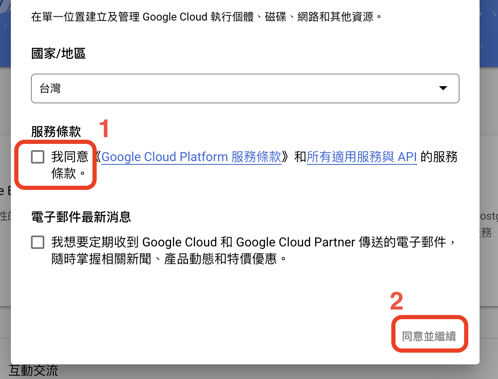   
  
1. 選取左上角 **API 和服務** -> **已啟用的 API 和服務**。
  
    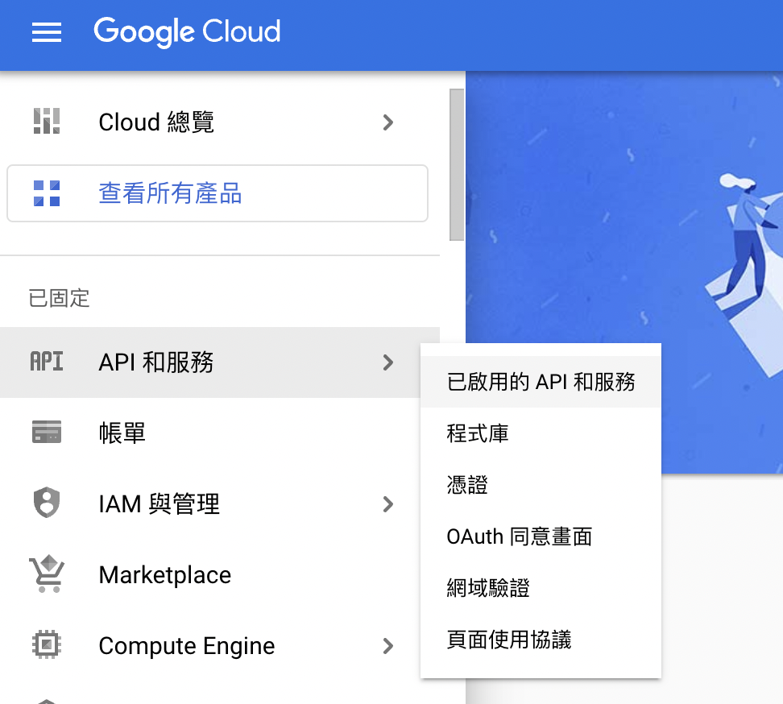
  
1. 左上角 **選取專案** -> **新增專案** -> **建立**。  
    由於目只是暫時使用，所以專案名稱等等的設定隨意就好。
  
    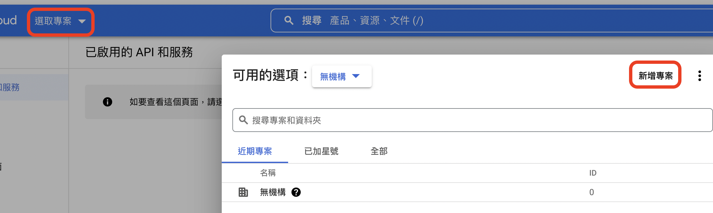
  
1. 現在網頁上會出現新專案所使用的 API 統計圖表，不過都是空的。  
    點選左邊選單的 **程式庫**。
  
    * 現在會出現如下的畫面，在搜尋欄上輸入 *Google Drive*，點選底下出現的 **Google Drive API**。
  
        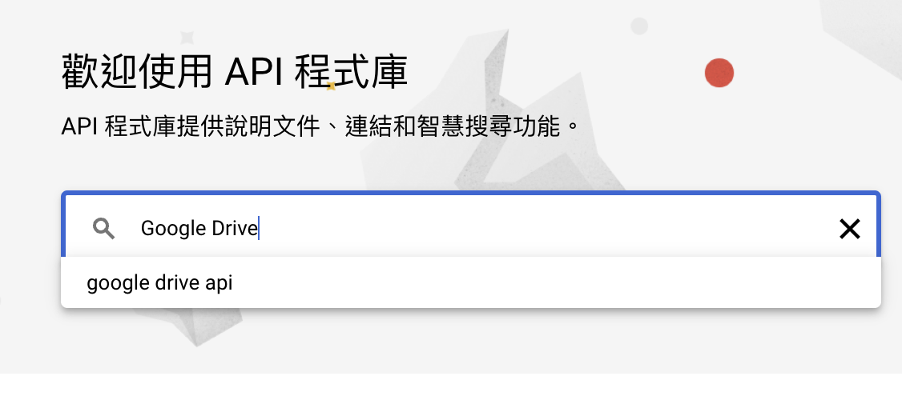
  
    * 點選後會出現搜尋的結果，點選第一個有 Google Drive 圖像的 *Google Drive API*，然後再點 **啟用**。
  
        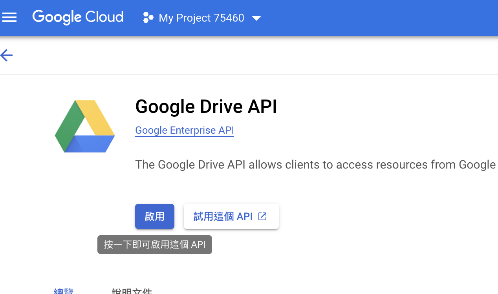

      等網頁讀取好之後，會出現 Google Drive API 的使用流量統計表。

1. 由於程式中使用 OAuth，所以我們要先建立 *OAuth 同意畫面*。  
    點選左邊選單 **OAuth 同意畫面** -> 選 **外部**。

    * 應用程式資訊的表單裡，名稱是之後會出現在同意頁面上的，不過由於 *沒有要 distribute 出去給別人用*，所以可以隨便填。  
        第二欄使用者支援電子郵件填入自己的 email，填目前帳號 email 就好。  
        第三欄是頁面上要顯示的 icon，不用填。  

      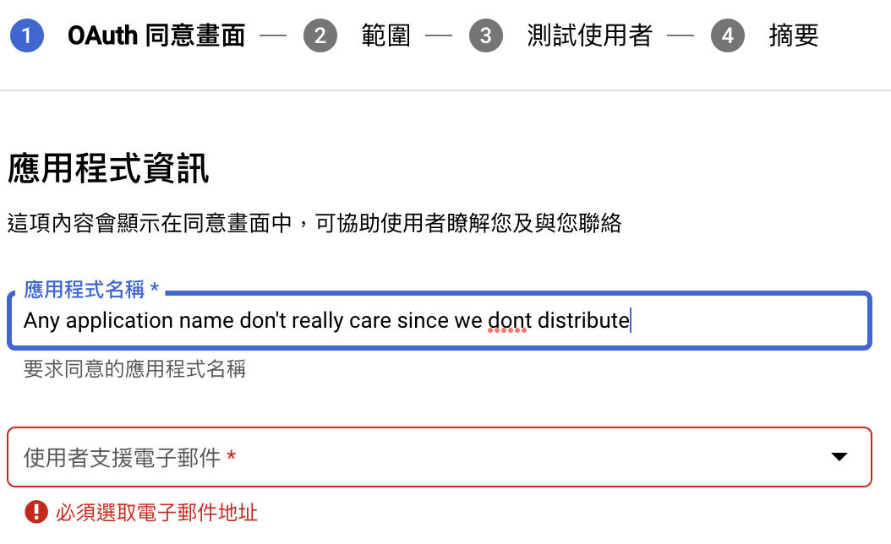

        最底下開發人員聯絡資訊，填入自己的 email，可以看使用者支援 email 一樣。  
    
        好了之後，點 **儲存並繼續**。

    * 再來要設定憑證能使用的 API 範圍 (Scope)，點選 **新增或移除範圍** -> 在右邊出現的表單最下方手動新增範圍裡填入
        scope:
  
        ```text
        https://www.googleapis.com/auth/drive.metadata.readonly, https://www.googleapis.com/auth/drive.readonly
        ```

        > **注意**: 填入的 scope 是兩個網址，中間用 **,** 連接。
  
        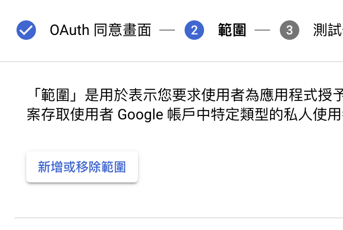
        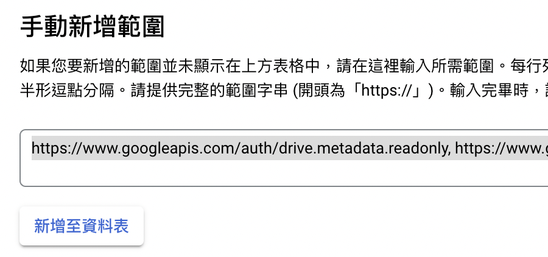

        填好後點 **新增至資料表**，然後再點 **更新** 關閉右邊的表單，再到頁面最下方點選 **儲存並繼續**。

        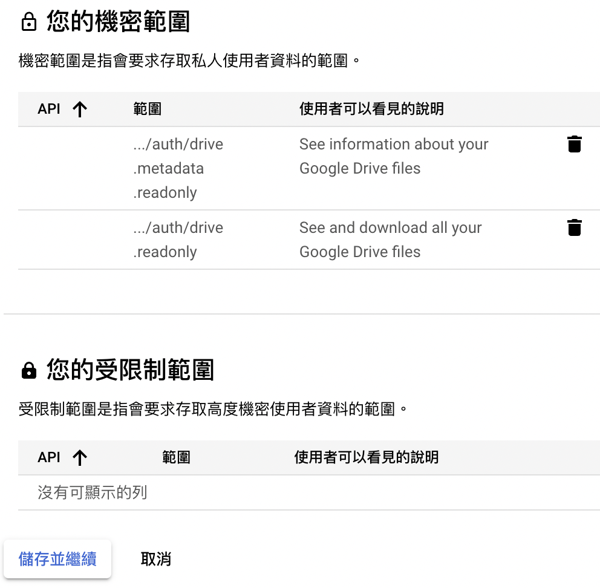

    * 接著我們要加入測式使用者。這樣就可以再不發佈這個憑證下執行程式。點選 **ADD USERS**，然後在右邊新增使用者的表單
        裡把 **所有之後需要匯出的 Google Drive 帳號填入**。每加完一個帳號，按一下空白鍵就可以加下一個；不正確的帳號
        網頁會有提示出現。

        都填好之後，點 **新增**，然後再點選 **儲存並繼續**。

1. 建立好畫面後，我們就可以建立一個新的憑證讓程式使用。

    * 點選左邊 **憑證** -> 讀取後頁面上方子選單的 **建立憑證** -> **OAuth 用戶端 ID**。

        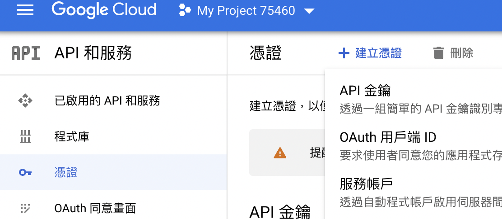

    * 在應用程式類型裡，選 **電腦版應用程式**。接者出現的名稱目前不重要，直接點 **建立**。

        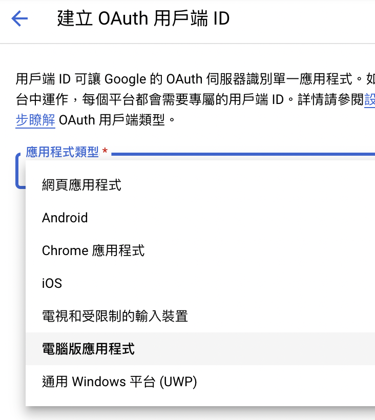

    * 等系統建立好之後，點選 **下載 json**。

        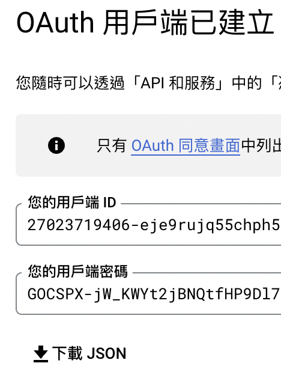

    * 把下載下來的 `client_secret_xxxxxxx......json` 改名為 `client_secrets.json`，移動到 repository 的資
        料夾下。